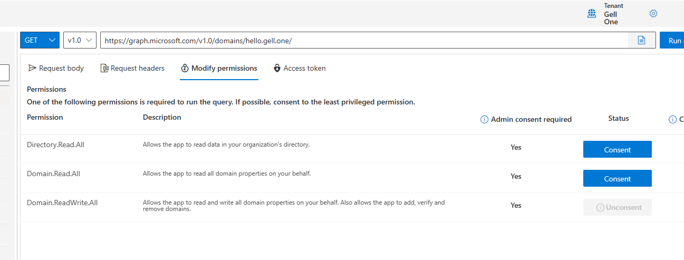
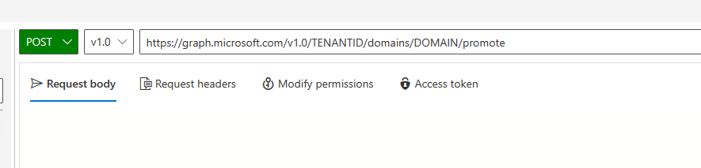

# Prereqs

- MSOnline Module
- Graph Module
- 5.1 powershell

# STEP 1

Setup a subdomain

```powershell
New-MsolDomain -Name "child.mydomain.com"
```

# STEP 2

Run graph explorer 

### Permissions 
Make sure you set the right permissions 

`Domain.ReadWrite.All`

### Promote domain to `isRoot`

```
POST https://graph.microsoft.com/v1.0/TENANTID/domains/DOMAIN/promote
```

# STEP 3

## Configure Google Workspace as an IdP for Azure AD

1. Sign in to the [Google Workspace Admin Console](https://admin.google.com) with an account with *super admin* privileges
1. Select **Apps > Web and mobile apps**
1. Select **Add app > Search for apps** and search for *microsoft*
1. In the search results page, hover over the *Microsoft Office 365 - Web (SAML)* app and select **Select**
   :::image type="content" source="images/google/google-admin-search-app.png" alt-text="Screenshot showing Google Workspace and the search button for Microsoft Office 365 SAML app.":::
1. On the **Google Identity Provider details** page, select **Download Metadata** and take note of the location where the **IdP metadata** - `GoogleIDPMetadata.xml` - file is saved, as it will be used to setup Azure AD later
1. On the **Service provider detail*s** page
      - Select the option **Signed response**
      - Verify that the Name ID format is set to **PERSISTENT**
      - Depending on how the Azure AD users have been provisioned in Azure AD, you may need to adjust the **Name ID** mapping.\
        If using Google auto-provisioning, select **Basic Information > Primary email**
      - Select **Continue**
1. On the **Attribute mapping** page, map the Google attributes to the Azure AD attributes

    |Google Directory attributes|Azure AD attributes|
    |-|-|
    |Basic Information: Primary Email|App attributes: IDPEmail|

    > [!IMPORTANT]
    > You must ensure that your the Azure AD user accounts email match those in your Google Workspace.

1. Select **Finish**

After setting up app inside Google Workspace. You will need to turn on the app for all users or a select few inside a different OU.

1. Sign in to the [Google Workspace Admin Console](https://admin.google.com) with an account with *super admin* privileges
1. Select **Apps > Web and mobile apps**
1. Select **Microsoft Office 365**
1. Select **User access**
1. Select **ON for everyone > Save**

#
Copy the file out to a PS1 file and save in the same location as `GoogleIDPMetadata.xml`
```powershell
Set-ExecutionPolicy -ExecutionPolicy RemoteSigned -Scope CurrentUser -Force
Install-Module Microsoft.Graph -Scope CurrentUser
Import-Module Microsoft.Graph

$domainId = "<your domain name>"

$xml = [Xml](Get-Content GoogleIDPMetadata.xml)

$cert = -join $xml.EntityDescriptor.IDPSSODescriptor.KeyDescriptor.KeyInfo.X509Data.X509Certificate.Split()
$issuerUri = $xml.EntityDescriptor.entityID
$signinUri = $xml.EntityDescriptor.IDPSSODescriptor.SingleSignOnService | ? { $_.Binding.Contains('Redirect') } | % { $_.Location }
$signoutUri = "https://accounts.google.com/logout"
$displayName = "Google Workspace Identity"
Connect-MGGraph -Scopes "Domain.ReadWrite.All", "Directory.AccessAsUser.All"

$domainAuthParams = @{
  DomainId = $domainId
  IssuerUri = $issuerUri
  DisplayName = $displayName
  ActiveSignInUri = $signinUri
  PassiveSignInUri = $signinUri
  SignOutUri = $signoutUri
  SigningCertificate = $cert
  PreferredAuthenticationProtocol = "saml"
  federatedIdpMfaBehavior = "acceptIfMfaDoneByFederatedIdp"
}

New-MgDomainFederationConfiguration @domainAuthParams
```
[Click here to open the sample File in Git Repo](GoogleIDPSetup.ps1)

This will setup the domain to be federated. 


# STEP 4
```powershell
Set-MsolDomainAuthentication -DomainName $domainId -Authentication Federated
```

# STEP 5
Now if the users match domains it should prompt for google login after opening a MS page.

Example:


# MISC

Setup all users OnPremisesImmutableId if there is no Azure AD Connect. Sets the OnPremisesImmutableId to the users UserPrincipalName
```powershell
Connect-MgGraph -Scopes Directory.ReadWrite.All
$users = Get-MgUser | Select ID, UserPrincipalName
foreach($user in $users){Update-MgUser -UserId $user.ID -OnPremisesImmutableId $user.UserPrincipalName -Whatif}
```
OR

Setup specific OnPremisesImmutableId if there is no Azure AD Connect. 

Can be set to users UserPrincipalName or whatever is the primary email address is in Google Workspace
```powershell
$id = ""
$immutableID = "" # calico primary email 

Connect-MgGraph -Scopes Directory.ReadWrite.All
Update-MgUser -UserId $id -OnPremisesImmutableId $immutableID -Whatif
```

